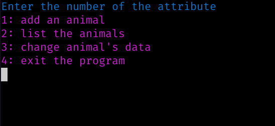

# Zoo system for trianing 




## classes

* **Animal class** (parent class)
* **Dome Class** (Child class)
* **Wild Class** (Child class)

***

## How to run

#### linux
```bash
make run
```

### windows 

```bash
g++ -ulimit -std=c++11 -O2 main.cpp -o main 
./main
```